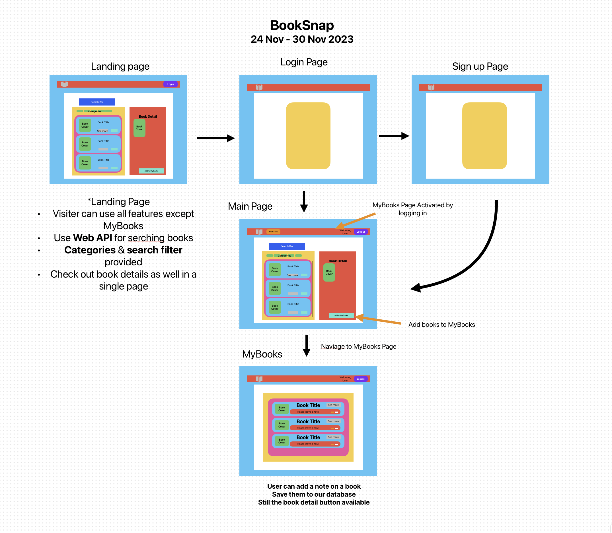

# SPA project: BookSnap&copy;

- 24 Nov - 1 Dec 2023 (1 week)
- Member: Annabelle , Jenny Zhong, Phougn Vu, Yonghee Kim (alphabetical order)

## Description

BookSnap&copy; is a full-stack single page web application that allows users to search books using the Google Books API. Users can search for books, add them to their collection, and manage their reading list.

## Timelines as agile method

### 1. Plan

24 Nov - 25 Nov

- Entity Relationship Diagram(EDR)
  
  - Simple user model for authentication
  - Picked book model properties from raw data
- Wire Frame
  
  - Landing page design & Wire frame page flows
  - Allowed user to search without login
  - My books page for logged in users
- Research book APIs
  - candidates : Google Books API, GoodReads API, Amazon Books API
  - Chose Google book API for reliability and richness in data

### 2. Design & Develop

25 Nov - 30 Nov

#### Technologies

|                     |              Technologies              |   Libraries |
| ------------------- | :------------------------------------: | ----------: |
| Client              | ReactJS, Google Books Wep Api,HTML/CSS | Material UI |
| Server              |            Express, NodeJS,            | JWT, Bcrypt |
| Data Solution       |                MongoDB                 |    Mongoose |
| VSC & Communication |           Github/Git, Trello           |             |

#### - Log-in System Build
1. Basic sign up and log in UI build
2. Created user model with minimal ID info
3. User authentication process with JWT, bcrypt 
#### - Search & Filter Function
1. Picked up data from raw data
2. Two options for search feature; dynamic search and regular

### 3. Test & Deploy

28 Nov - 30 Nov
#### Truble Shooting
1. Limited requests to API
- Deployed on Heroku(30 Nov)

### 4. Presentation & Review

1 Dec
1. Presentation